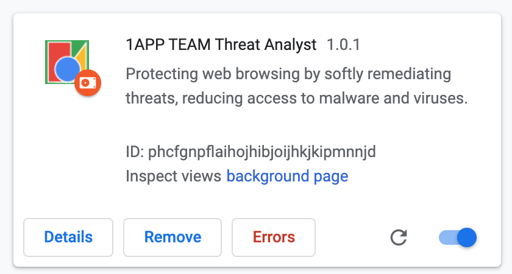

This Google Chrome extension is currently being designed to intercept URL requests and analyzing them against a threat model. If the URL is from a domain that has current threats the user will be alerted or blocked depending on the chosen setting.

